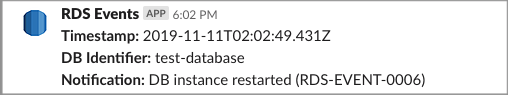
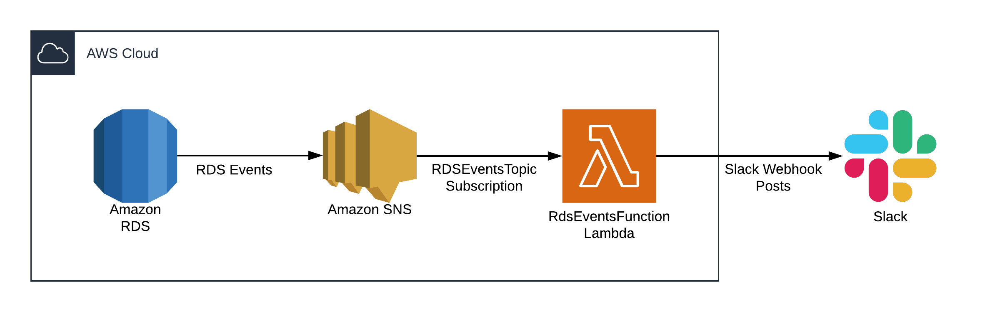

# rds-events-lambda
This repo contains everything needed to build, test, and deploy a lambda that receives RDS events via
SNS and posts state change messages to Slack.

Example Slack message:


For more information on RDS Events see [Amazon RDS Event Categories and Event Messages](https://docs.aws.amazon.com/AmazonRDS/latest/UserGuide/USER_Events.html#USER_Events.Messages).

## RDS Events Lambda Architecture
The architecture utilizes the built-in RDS events that are delivered to SNS.  A Lambda then subscribes to the RdsEventsTopic SNS topic and delivers state change notifications to Slack via a Slack Webhook.  While the architecture may seem very simple, it is serverless and can easily support many databases without the need to scale or manage any infrastructure on AWS.  Additionally, it is extremely cost-effective, as AWS provides 1,000,000 free invocations per month.  



___

## The AWS Serverless Application Model (SAM)

The [AWS Serverless Application Model (SAM)](https://docs.aws.amazon.com/serverless-application-model/latest/developerguide/) is an open-source framework that can be used to build serverless applications on AWS.  SAM is basically an extension of AWS CloudFormation that makes it very straight forward to develop, debug, build and deploy serverless applications.  SAM provides the following:  

* Single-deployment configuration
* Extension of AWS CloudFormation
* Built-in best practices
* Local debugging and testing

SAM is used in all aspects of the SDLC of this project.

___

## Developer Workstation Set-Up
This project can be maintained and deployed on pretty much any type of developer workstation (Linux, Windows, and macOS) as long as the following are installed:

**Node.js**  
Node.js 10+ is required to perform builds and deploy the rds-events-lambda lambda.  For more information on installing Node.js see [Node.js Downloads](https://nodejs.org/en/download/)

**AWS CLI**  
To use the SAM CLI ensure you have the latest version of the AWS CLI installed and configured on your workstation.  For more information on installing and updating the AWS CLI see [Installing the AWS CLI](https://docs.aws.amazon.com/cli/latest/userguide/cli-chap-install.html)

**SAM CLI**  
The SAM CLI must be installed on your workstation to perform builds and deploys to AWS. For more information see [Installing the AWS SAM CLI](https://docs.aws.amazon.com/serverless-application-model/latest/developerguide/serverless-sam-cli-install.html) 

___

## Installation

You must install the Node.js dependencies before deploying the rds-events-lambda.  To install the Node.js dependencies execute the following command from the root of this project:
```bash
npm install
```

To install rds-events-lambda simply run the deploy script from the root of this project as follows:
```bash
./scripts/deploy-stack.js --env dev --s3-bucket devops-bucket \
    --db-identifier db-instance-1 --slack-webhook-url slack-webhook-url
```
**REPLACE:**  
```dev``` with the name of the Environment (dev, test, staging, prod, etc.) you wish to deploy the lambda for  
 ```devops-bucket``` with the bucket name for the deployment artifacts  
 ```db-instance-1``` with the DB identifier of the RDS instance you wish to monitor events for  
 ```slack-webhook-url``` with the Slack Webhook URL to post messages to 

## Cleanup (Stack Deletion)
To cleanup a deployment, simply execute the following command, this will delete the CloudFormation stack:
```bash
./scripts/delete-stack.js --env dev
```

**REPLACE:**  
 ```dev``` with the name of the Environment (dev, test, staging, prod, etc.) you wish to delete the stack from.  
